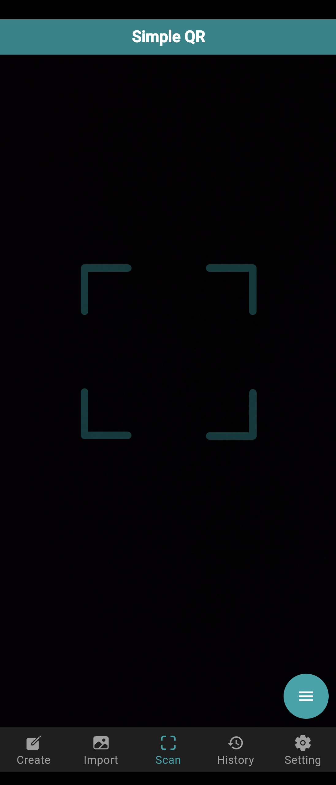
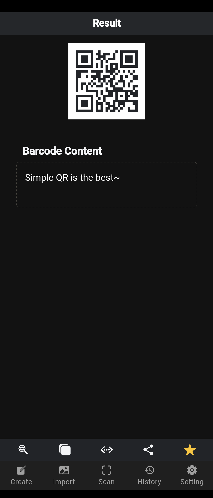
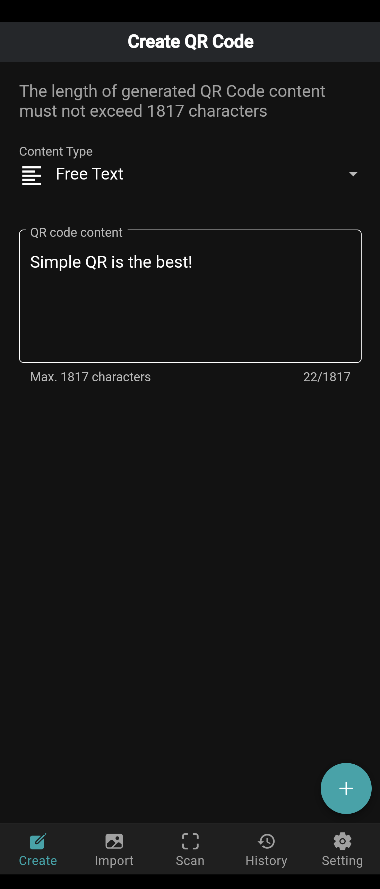
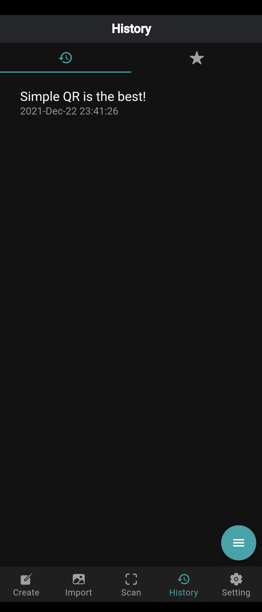
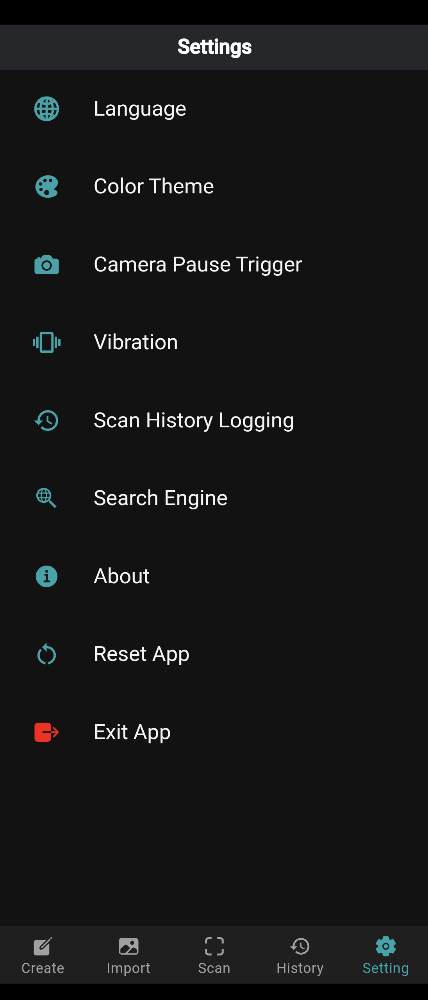

# Simple QR

<p align="center">

</p>

<p align="center">
  <a href="#about">About</a>
• <a href="#features">Features</a>
• <a href="#screenshots">Screenshots</a>
• <a href="#download">Download</a>
• <a href="#support-developer">Support Developer</a>
</p>
<p align="center">
  <a href="#contribute">Contribute</a>
• <a href="#contributors">Contributors</a>
• <a href="#changelogs">Changelogs</a>
• <a href="#framework">Framework</a>
• <a href="#privacy-policy">Privacy Policy</a>
• <a href="#license">License</a>
</p>

## About

Simple QR (簡易QR) is an open-source app, providing the simplest way to scan, create and manage QR codes. No backend service connected. No data collected from you. No ads.

## Features

- English, Traditional Chinese and Simplified Chinese are supported now.

- Main features

1. Scan QR Code, 1D Barcode, Aztec Code, Data Matrix Code and PDF417 Barcode using camera.

2. Scan QR Code using image file.

3. Provide you post actions after scanning:
"Search" - use decoded content as keyword to execute web search
"Copy" - click to copy decoded content
"Base64" - execute Base64 encode and decode
"Share" - share the original QR code image
"Bookmark" - save the scanning record and bookmark it

4. Provide you special post actions, if the barcode content is URL, vCard Contact, Phone Number, Message or Email.

5. Create QR code from templates, including Free Text, URL, vCard Contact, Phone Number, Message, Email and Wi-Fi.

6. View, manage and back up scanning records and bookmarks that stored in the local offline storage.

7. Enable torch/flashlight during scanning.

8. Personalize the app and settings, e.g. language and color theme.

## Screenshots

<p align="start">






 </p>

## Languages Supported

- English (en)
- Traditional Chinese 正體中文 (zh-HK)
- Simplified Chinese 简体中文 (zh-CN)

You are welcomed to help us do translations in more languages! (see <a href="#how-to-help-to-do-translation">section</a>)

## Download

Please download the app from Google Play.

<a href="https://play.google.com/store/apps/details?id=com.tomfong.simpleqr">
  
</a>

## Support Developer

To support this project, you can buy me a milk tea by making a donation :) (<a href="mailto:tomfong.dev@gmail.com">Email me</a> for details)

Thanks for your support!

## Contribute

- Star the project
- Do translation for different languages
- Open issue for bug reports
- Email me for any ideas regarding Simple QR or Project Simple

### Build the project

- Run ```npm install``` to install all dependencies
- Run ```npm run build```
- In ```android/capacitor-cordova-android-plugins/src/main/AndroidManifest.xml```, add ```android:exported="true"``` inside receiver tag.
- In ```android/capacitor-cordova-android-plugins/src/main/java/nl/xservices/plugins/SocialSharing.java```, change line 274 to

  ```java
  final PendingIntent pendingIntent = PendingIntent.getBroadcast(cordova.getActivity().getApplicationContext(), 0, receiverIntent, PendingIntent.FLAG_UPDATE_CURRENT|PendingIntent.FLAG_IMMUTABLE);
  ```

- In ```android/app/src/main/res/values/styles.xml```, change

  ```xml
  <style name="AppTheme.NoActionBarLaunch" parent="AppTheme.NoActionBar">
    <item name="android:background">#00a5aa</item>
  </style>
  ```

### How to help to do translation?

0. (Optional) Clone or fork this project
1. Take a look at this [JSON](https://github.com/tomfong/simple-qr/blob/master/src/assets/i18n/en.json)
2. Copy the JSON, rename it to <i>locale</i>.json, e.g. ja.json for Japanese, de.json for German
3. Change the values of each key. Try to stick to the meaning of the original wordings. <b>DO NOT</b> change key names.
4. Commit it (please place the JSON in the same directory, i.e. src/assets/i18n), or [email]('mailto:tomfong.dev@gmail.com') me the JSON.

## Changelogs

### 2.3.0

- iOS app was born!
- Improved performance and fixed known issues

#### 2.2.0

- New "Backup and Restore" feature
- Minor UI update
- Improved performance and fixed known issues

#### 2.1.0 - 2.1.2

- Correctly display Traditional Chinese if system language is Yue
- Simplified Chinese is supported now
- UI updated: Android native toast, new button layout and more!
- Back button is available on all pages
- Barcode type can be shown after scanning
- Improved performance and fixed known issues

#### 2.0.2

- Fixed QR code sharing crash issue

#### 2.0.0 - 2.0.1

- Revamped the scanning engine
- Removed camera pause feature due to technical problems
- Improved performance and fix issues

#### 1.5.0

- Support Black color theme
- Support zooming in QR code
- Vibration effect update
- Minor UI update
- Improve performance and fix issues

#### 1.4.0

- Migrated the app to Capacitor
- Improve experience when using "Special Actions" feature in Result page
- Show barcode type when scanning
- Improve performance and fix issues

#### 1.3.0 - 1.3.3

- Redesign UI/UX
- Add vibration on/off setting
- Remove WiFi connection feature
- Remove ads
- Improve performance and fix issues

#### 1.2.0 - 1.2.1

- Support image scanning to read QR code
- UI updated
- Improve performance and fix issues

#### 1.1.0 - 1.1.5

- Support 1D Barcode, Aztec Code, Data Matrix Code and PDF417 Barcode scanning
- Support generating QR code with templates (Free Text, Email, Phone, Message, URL, vCard Contact and Wi-Fi)
- Improve performance of loading records on History page

#### 1.0.2

- Removed in-app purchase

#### 1.0.1

- Support Android 6.0 or above devices

#### 1.0.0

- The first release version. Thanks for your support! Please feel free to rate the app and leave comments.

## Framework

```sh
    Ionic CLI                       : 6.19.0
    Ionic Framework                 : @ionic/angular 6.1.2
    @angular-devkit/build-angular   : 13.3.3
    @angular-devkit/schematics      : 13.3.3
    @angular/cli                    : 13.3.3
    @ionic/angular-toolkit          : 6.1.0

    Capacitor CLI                   : 3.4.3
    @capacitor/android              : 3.4.3
    @capacitor/core                 : 3.4.3

    Cordova CLI                     : 10.0.0

    Android SDK Tools               : 26.1.1
    NodeJS                          : v14.15.4
    npm                             : 6.14.10
```

## Privacy Policy

Please read the [Privacy Policy](https://www.privacypolicies.com/live/771b1123-99bb-4bfe-815e-1046c0437a0f)

## License

Please view the [LICENSE](LICENSE)
