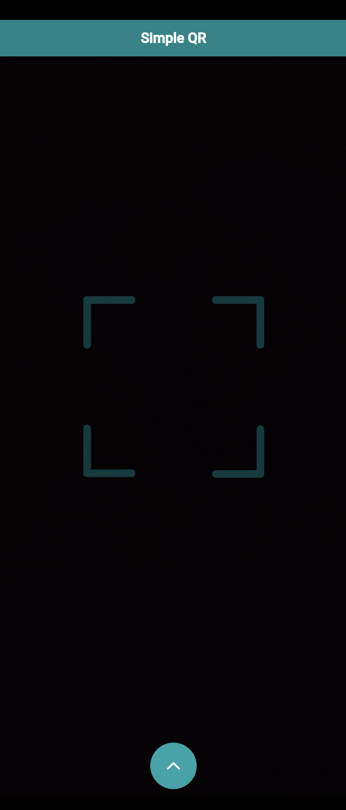
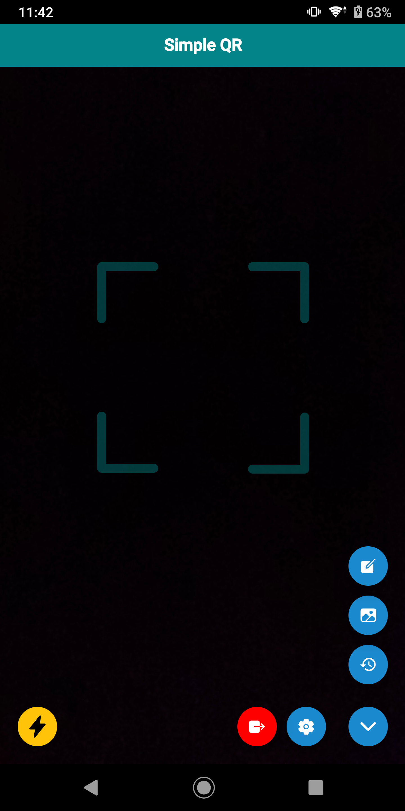
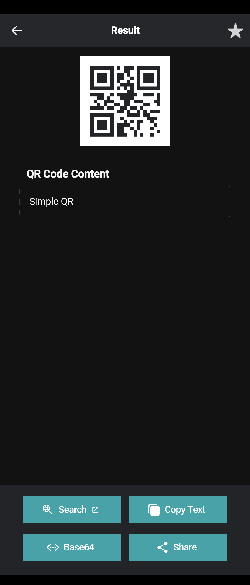
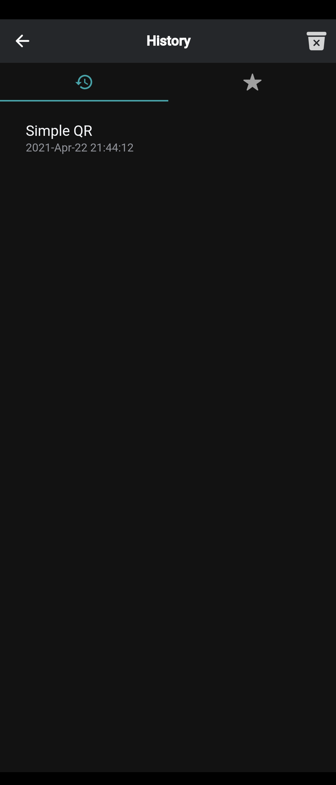
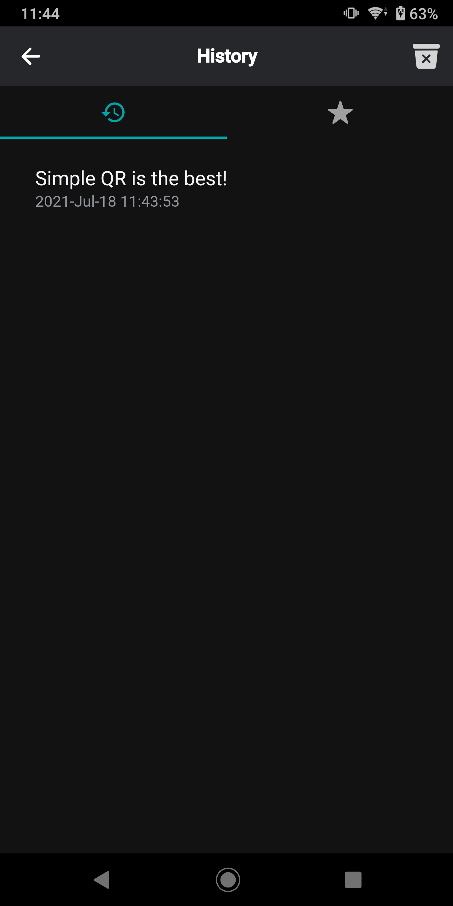
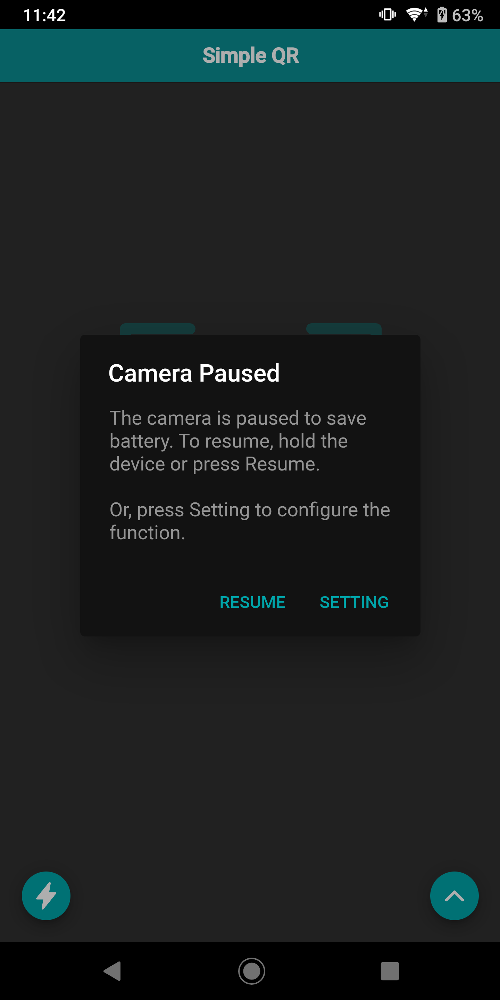
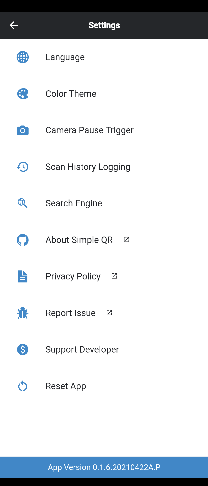

# Simple QR

<p align="center">

</p>

<p align="center">
  <a href="#about">About</a>
• <a href="#features">Features</a>
• <a href="#screenshots">Screenshots</a>
• <a href="#download">Download</a>
• <a href="#support-developer">Support Developer</a>
</p>
<p align="center">
  <a href="#contribute">Contribute</a>
• <a href="#contributors">Contributors</a>
• <a href="#changelogs">Changelogs</a>
• <a href="#framework">Framework</a>
• <a href="#privacy-policy">Privacy Policy</a>
• <a href="#license">License</a>
</p>

## About

Simple QR (簡易QR) is an open-source app, providing a simple way for you to scan, generate and manage QR codes. No backend service connected. No data collected from you. No mandatory ads.

The idea of Simple App is to make applications or tools simple, light and easy to be used. Feel free to <a href="mailto:tomfong.dev@gmail.com">email me</a> if you have any idea to the project.

## Features

- Fruitful post actions can be done after scanning a QR code,
  - Search - use scanned content as keyword to execute Google search
  - Copy - one click to copy scanned content
  - Base64 - execute Base64 encode and decode
  - Share - share the original QR code as an image in many platforms
  - Bookmark - save the record by bookmarking it

  For some specific types of QR code, more post actions are provided,
  - URL - one click to open browser and browse the webpage
  - Contact (vCard) - in-app contact adding
  - Phone Number (tel: prefix) - in-app contact adding and phone calling
  - Message (smsto: prefix) -  in-app contact adding and message preparing
  - Email (mailto: prefix) - in-app email preparing
  - Wi-Fi (wifi: prefix) - one click to connect to the Wi-Fi network (for Android 9 or before)
- Flashlight can be enabled during scanning
- A simple UI is provided to generate QR codes by inputting text
- Previous scanning records and bookmarks can be viewed and managed
- Settings can be personalized to fit users' requirements, e.g. language, color theme

## Screenshots

<p align="start">







 </p>

## Languages Supported

- English (en)
- Traditional Chinese 正體中文 (zh-HK)

You are welcomed to help us do translations in more languages! (see <a href="#how-to-help-to-do-translation">section</a>)

## Download

Please download the app from Google Play.

<a href="https://play.google.com/store/apps/details?id=com.tomfong.simpleqr">
  
</a>

## Support Developer

To support this project, you can buy me a milk tea by making a donation :) (<a href="mailto:tomfong.dev@gmail.com">Email me</a> for details)

Or, watching optional ads in the app (Settings → Support Developer) is also appreciated.

Thanks for your support!

## Contribute

- Star the project
- Do translation for different languages
- Open issue for bug reports
- Email me for any ideas regarding Simple QR or Project Simple

### If you want to build the project

- run ```npm install``` to all dependencies
- Prepare a .env file in the root directory with the following keys with arbitrary values
  - STORAGE_SCAN_RECORD_KEY
  - STORAGE_BOOKMARK_KEY
  - PAYPAL_DONATE_URL
  
  e.g.

  ```env
    STORAGE_SCAN_RECORD_KEY = "testing-scan-record"
    STORAGE_BOOKMARK_KEY = "testing-bookmark"
    PAYPAL_DONATE_URL = "https://github.com/tomfong/simple-qr#support-developer"
  ```

  Then, run ```npm run setenv``` to generate angular environment files.
- Go to ```platforms/android/app/src/main/java/com/bitpay/cordova/qrscanner/QRScanner.java``` and find the following codes

  ```java
    ArrayList<BarcodeFormat> formatList = new ArrayList<BarcodeFormat>();
    formatList.add(BarcodeFormat.QR_CODE);
  ```

  and then replace it by

  ```java
    ArrayList<BarcodeFormat> formatList = new ArrayList<BarcodeFormat>();
    formatList.add(BarcodeFormat.AZTEC);
    formatList.add(BarcodeFormat.CODABAR);
    formatList.add(BarcodeFormat.CODE_128);
    formatList.add(BarcodeFormat.CODE_39);
    formatList.add(BarcodeFormat.CODE_93);
    formatList.add(BarcodeFormat.DATA_MATRIX);
    formatList.add(BarcodeFormat.EAN_13);
    formatList.add(BarcodeFormat.EAN_8);
    formatList.add(BarcodeFormat.ITF);
    formatList.add(BarcodeFormat.PDF_417);
    formatList.add(BarcodeFormat.QR_CODE);
    formatList.add(BarcodeFormat.RSS_14);
    formatList.add(BarcodeFormat.RSS_EXPANDED);
    formatList.add(BarcodeFormat.UPC_A);
    formatList.add(BarcodeFormat.UPC_E);
    formatList.add(BarcodeFormat.UPC_EAN_EXTENSION);
  ```

- If you want to run on Android device, run ```npm run start:an```. You may encounter an error like

  ```sh
  ...APPLICATION_ID at AndroidManifest.xml Error: duplicated...
  ```

  Then, you need to go to ```platforms/android/android.json``` and then delete the following lines

  ```json
  {
    "xml": "<meta-data android:name=\"com.google.android.gms.ads.APPLICATION_ID\" android:value=\"ca-app-pub-xxx~yyy\" />",
    "count": 1
  }
  ```

  and, go to ```platforms/android/app/src/AndroidManifest.xml``` and then delete the following lines

  ```xml
  <meta-data android:name="com.google.android.gms.ads.APPLICATION_ID" android:value="ca-app-pub-xxx~yyy" />
  ```

  After that, re-run ```npm run start:an```.

### How to help to do translation?

0. (Optional) Clone or fork this project
1. Take a look at this [JSON](https://github.com/tomfong/simple-qr/blob/master/src/assets/i18n/en.json)
2. Copy the JSON, rename it to <i>locale</i>.json, e.g. ja.json for Japanese, de.json for German
3. Change the values of each key. Try to stick to the meaning of the original wordings. <b>DO NOT</b> change key names.
4. Commit it (please place the JSON in the same directory, i.e. src/assets/i18n), or [email]('mailto:tomfong.dev@gmail.com') me the JSON.

## Contributors

Coming soon!

## Changelogs

### 1.2.0 (Current)

- Support image scanning to read QR code
- UI updated
- Improve performance and fix issues

#### 1.1.5

- Support 1D Barcode, Aztec Code, Data Matrix Code and PDF417 Barcode scanning
- Support generating QR code with templates (Free Text, Email, Phone, Message, URL, vCard Contact and Wi-Fi)
- Improve performance of loading records on History page

#### 1.0.2

- Removed in-app purchase

#### 1.0.1

- Support Android 6.0 or above devices

#### 1.0.0

- The first release version. Thanks for your support! Please feel free to rate the app and leave comments.

## Framework

```sh
    Ionic CLI                       : 6.13.1
    Ionic Framework                 : @ionic/angular 5.6.4
    @angular-devkit/build-angular   : 0.1102.5
    @angular-devkit/schematics      : 11.2.5
    @angular/cli                    : 11.2.5
    @ionic/angular-toolkit          : 3.1.1

    Cordova CLI                     : 10.0.0

    Android SDK Tools               : 26.1.1
    NodeJS                          : v14.15.4
    npm                             : 6.14.10
```

## Privacy Policy

Please read the [Privacy Policy](https://www.privacypolicies.com/live/771b1123-99bb-4bfe-815e-1046c0437a0f)

## License

Please view the [LICENSE](LICENSE)
