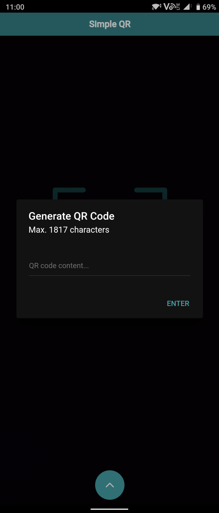
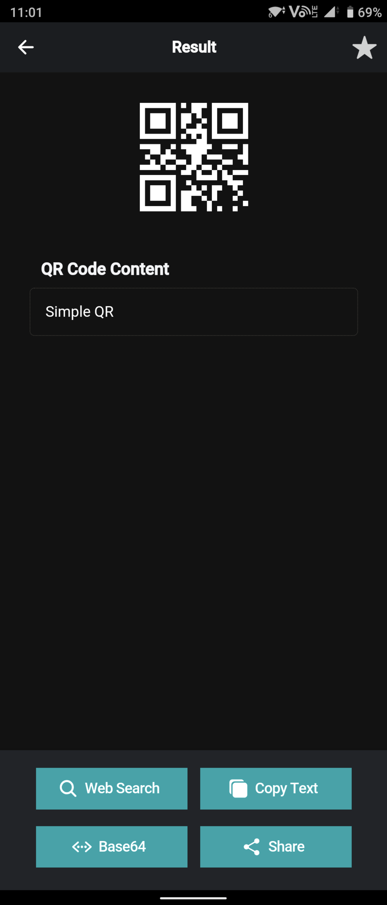
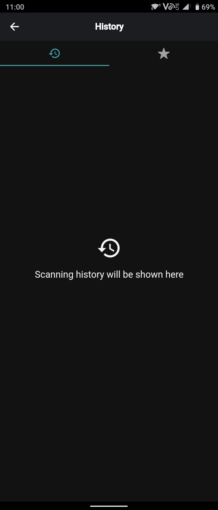
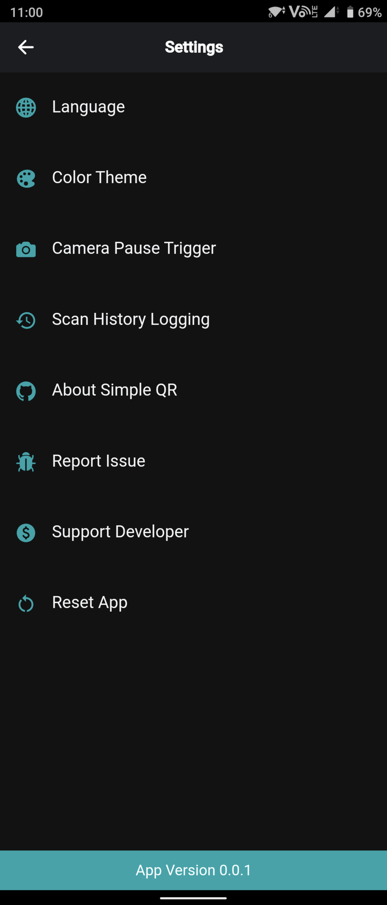

# Simple QR


<p align="center">

</p>
<p align="center">
Simple QR - First Product of Project Simple
</p>
<p align="center">
made by Hongkonger
</p>

<p align="center">
  <a href="#about">About</a>
• <a href="#features">Features</a>
• <a href="#screenshots">Screenshots</a>
• <a href="#download">Download</a>
• <a href="#support-developer">Support Developer (Donate)</a>
</p>
<p align="center">
  <a href="#contribute">Contribute</a>
• <a href="#contributors">Contributors</a>
• <a href="#changelogs">Changelogs</a>
• <a href="#framework">Framework</a>
• <a href="#privacy-policy">Privacy Policy</a>
• <a href="#license">License</a>
</p>

## About

Simple QR (簡易QR) is the first product of my project - Project Simple. It is an is an open-source Android app which provides a simple way for users to scan, generate and manage QR codes. All activities can be done offline. No backend service connected. No data collected.

### Project Simple

The idea of Project Simple is to make applications or tools simple, light and easy to be used. Feel free to [email me]('mailto:tomfong.dev@gmail.com') if you have any idea to the project.

## Features


- Fruitful post actions can be done after scanning a QR code,
  - Search - use scanned content as keyword to execute Google search
  - Copy - one click to copy scanned content
  - Base64 - execute Base64 encode and decode
  - Share - share the original QR code as an image in many platforms
  - Bookmark - save the record by bookmarking it

  For some specific types of QR code, more post actions are provided,
  - URL - one click to open browser and browse the webpage
  - Contact (vCard) - in-app contact adding
  - Phone Number (tel: prefix) - in-app contact adding and phone calling
  - Message (smsto: prefix) -  in-app contact adding and message preparing
  - Email (mailto: prefix) - in-app email preparing
  - Wi-Fi (wifi: prefix) - one click to connect to the Wi-Fi network (for Android 9 or before)
- Flashlight can be enabled during scanning
- A simple UI is provided to generate QR codes by inputting text
- Previous scanning records and bookmarks can be viewed and managed
- Settings can be personalized to fit users' requirements, e.g. language, color theme

## Screenshots

<p align="center">





 </p>

## Languages Supported


- English (en)
- Traditional Chinese 正體中文 (zh-HK)

You are welcomed to help us do translations in more languages! (see <a href="#how-to-do-translation">section</a>)

## Download

Coming soon on


## Support Developer

To support this project, Project Simple or developer, you can buy me a milk tea by making a donation :)

[](https://paypal.me/tomfongdev?locale.x=en_GB)

Or, watching optional ads in the app (Settings → Support Developer) is also appreciated.

Thanks for your support!

## Contribute

- Star the project
- Do translation for different languages
- Open issue for bug reports
- Email me for any ideas regarding Simple QR or Project Simple

### How to do translation?

0. (Optional) Clone or fork this project
1. Take a look at this [JSON](https://github.com/tomfong/simple-qr/blob/master/src/assets/i18n/en.json)
2. Copy the JSON, rename it to <i>locale</i>.json, e.g. ja.json for Japanese, de.json for German
3. Change the values of each key. Try to stick to the meaning of the original wordings. <b>DO NOT</b> change key names.
4. Commit it (please place the JSON in the same directory, i.e. src/assets/i18n), or [email]('mailto:tomfong.dev@gmail.com') me the JSON.

## Contributors

Coming soon!

## Changelogs

Coming soon!

## Framework

```sh
    Ionic CLI                       : 6.13.1
    Ionic Framework                 : @ionic/angular 5.6.1
    @angular-devkit/build-angular   : 0.1102.5
    @angular-devkit/schematics      : 11.2.5
    @angular/cli                    : 11.2.5
    @ionic/angular-toolkit          : 3.1.1

    Cordova CLI                     : 10.0.0

    Android SDK Tools               : 26.1.1
    NodeJS                          : v14.15.4
    npm                             : 6.14.10
```

## Privacy Policy

Please read the [Privacy Policy](https://www.privacypolicies.com/live/771b1123-99bb-4bfe-815e-1046c0437a0f)

## License

Please view the [LICENSE](LICENSE)
