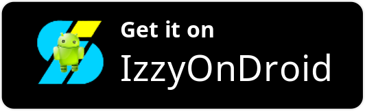

# Simple QR

<p align="center">

</p>

<p align="center">
  <a href="#about">About</a>
• <a href="#features">Features</a>
• <a href="#support-developer">Support Developer</a>

</p>
<p align="center">
  <a href="#contribute">Contribute</a>
• <a href="#framework">Framework</a>
• <a href="#privacy-policy">Privacy Policy</a>
• <a href="#license">License</a>
</p>

## About

Simple QR (簡易QR) is an app providing the simplest way to scan, create and store QR codes on your phone. No backend service connected. No data collected. No ads.

It's available on the App Store, Google Play and IzzyOnDroid. You can also download the apk from <a href="https://github.com/tomfong/simple-qr/releases">release</a>.

| App Store | Google Play | IzzyOnDroid |
|:-:|:-:|:-:|
| [](https://apps.apple.com/us/app/simple-qr-by-tom-fong/id1621121553) | [](https://play.google.com/store/apps/details?id=com.tomfong.simpleqr) | [](https://apt.izzysoft.de/fdroid/index/apk/com.tomfong.simpleqr) |

## Features

By using the app, you can

1. Scan QR Code and other barcodes in a second, including UPC, EAN, Code 39/128, ITF, Codabar, Aztec, Data Matrix, PDF417, MaxiCode and GS1 DataBar.

2. Import image files and scan the QR Code on it.

3. Create QR code from templates, which includes Free Text, URL, vCard Contact, Phone Number, Message, Email and Wi-Fi.

4. Automatically log results that you scan, create or view again. These logged records can be bookmarked for quick access, and also backupable.

5. Do tasks on the result with a tap, including but not limited to
    * Use it as a keyword to do web search.
    * Quickly copy it to the clipboard.
    * Execute base64 encoding/decoding on it.
    * Generate a new shareable QR code by using it as the content.
    * Directly do special tasks, if it is a link, vCard contact, phone number, message or email.

6. Adjust the generated QR code, e.g. error correction level and screen brightness.

7. Customize the app, e.g. app initial page, language and color theme etc.

### Demo

[](https://www.youtube.com/watch?v=D57VveikN8U)

## Languages Supported

* English (en)
* Traditional Chinese 正體中文 (zh-HK)
* Simplified Chinese 简体中文 (zh-CN)

You are welcomed to help me do translations in more languages (see <a href="#how-to-do-the-translation">section</a>)

## Support Developer

If you want to support me or my projects, please <a href="https://github.com/tomfong"><b>click me</b></a>😊

## Contribute

* Star the project
* Do translation for different languages
* Open issues for reporting bugs or any new ideas

### How to do the translation?

1. Take a look at this [JSON](https://github.com/tomfong/simple-qr/blob/master/src/assets/i18n/en.json)
2. Copy the JSON, rename it to <i>locale</i>.json, e.g. ja.json for Japanese, de.json for German
3. Change the values of each key. Try to stick to the meaning of the original wordings. <b>DO NOT</b> change key names.
4. [Email]('mailto:tomfong.dev@gmail.com') the JSON to me.

## Build the project (Android)

1. Run ```npm install``` to install all dependencies
2. Run ```npm run sync``` and ```npm run copy:an```
3. In ```android/capacitor-cordova-android-plugins/src/main/AndroidManifest.xml```, add ```android:exported="true"``` inside receiver tag.
4. In ```android/capacitor-cordova-android-plugins/src/main/java/nl/xservices/plugins/SocialSharing.java```, change line 274 to

    ```java
    final PendingIntent pendingIntent = PendingIntent.getBroadcast(cordova.getActivity().getApplicationContext(), 0, receiverIntent, PendingIntent.FLAG_UPDATE_CURRENT|PendingIntent.FLAG_IMMUTABLE);
    ```

5. In ```android/app/src/main/res/values/styles.xml```, change

    ```xml
    <style name="AppTheme.NoActionBarLaunch" parent="AppTheme.NoActionBar">
      <item name="android:background">#00a5aa</item>
    </style>
    ```

## Framework

```sh
    Ionic CLI                       : 6.19.0
    Ionic Framework                 : @ionic/angular 6.1.6
    @angular-devkit/build-angular   : 13.3.6
    @angular-devkit/schematics      : 13.3.6
    @angular/cli                    : 13.3.6
    @ionic/angular-toolkit          : 6.1.0

    Capacitor CLI                   : 3.5.1
    @capacitor/android              : 3.5.1
    @capacitor/core                 : 3.5.1
    @capacitor/ios                  : 3.5.1

    Cordova CLI                     : 10.0.0

    Android SDK Tools               : 26.1.1
    NodeJS                          : v16.15.4
    npm                             : 8.8.0
```

## Privacy Policy

Please read the [Privacy Policy](https://www.privacypolicies.com/live/771b1123-99bb-4bfe-815e-1046c0437a0f)

## License

Please view the [LICENSE](LICENSE)
